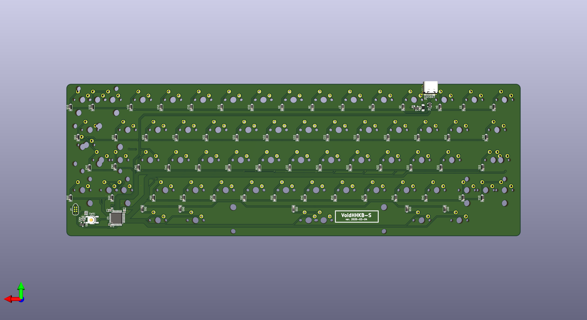
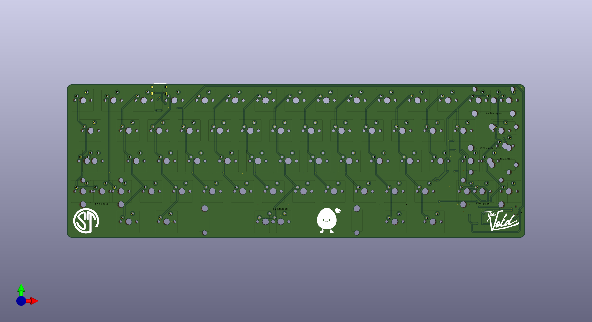

# VoidHHKB-S

## Ordering from JLCPCB

1) Head to the [JLCPCB order page](https://cart.jlcpcb.com/quote).

2) Upload the `VoidHHKB-Hotswap.zip` file in `production/`.

3) Set the quantity of the PCBs you want made.

4) Set your desired PCB parameters. Here are some suggested parameters: (Everything else can be kept at their default)

- PCB Color: **Purple**
- Surface Finish: **ENIG**
- Remove Order Number: **Yes**   

5) Enable the PCB Assembly option at the bottom, and set the following parameters:

- PCBA Type: **Standard**
- Assembly Side: **Bottom**

6) Press `Confirm` at the bottom or `NEXT` on the right to get to the next page.

7) Click `NEXT` to get to the Bill of Materials tab.

8) Click `Add BOM File` and select the `bom.csv` file in `production/`.

9) Click `Add CPL File` and select the `positions.csv` file in `production/`. Click `Process BOM & CPL` to proceed.

10) You should be presented with a list of all the components and quantities needed. Double check there are no missing components. If there are, you will have to find substitute components for it. Click `NEXT` to proceed.

11) You should be presented with a view of the PCB and its components. Click `NEXT` to proceed.

12) You should see a breakdown of the price for the PCBs you want to order. Select `Keyboard - HS Code 847330` under `Office Appliance Accessories` for the Product Description.

13) Save to cart, and pay for it!

## Flashing Firmware

1) To do...

## Using VIA

Temp instructions until I get around to merging files into QMK repo...
1) To do...

## Build your own firmware

1) To do...