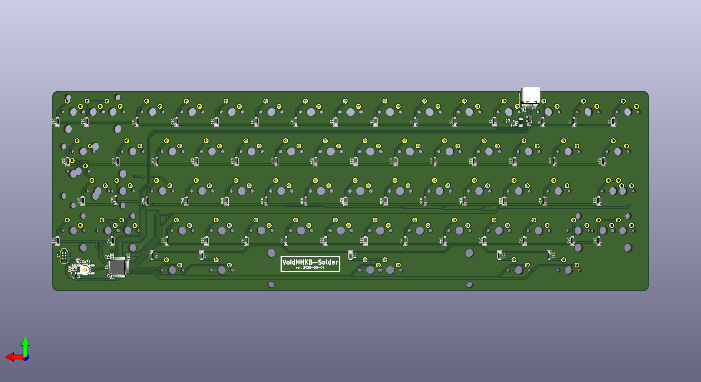
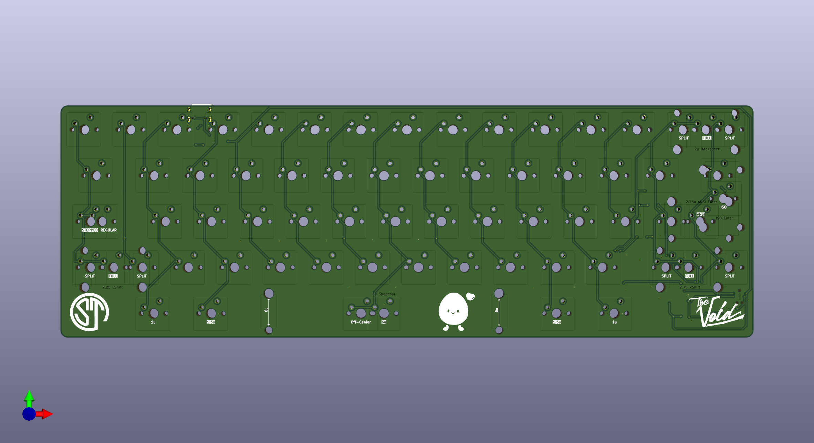

# VoidHHKB-Solder

## Ordering from JLCPCB

1) Head to the [JLCPCB order page](https://cart.jlcpcb.com/quote).

2) Upload the `VoidHHKB-Solder.zip` file in `production/`.

3) Set the quantity of the PCBs you want made.

4) Set your desired PCB parameters. Here are some suggested parameters: (Everything else can be kept at their default)

- PCB Color: **Purple**
- Surface Finish: **ENIG**
- Remove Order Number: **Yes**   

5) Enable the PCB Assembly option at the bottom, and set the following parameters:

- PCBA Type: **Standard**
- Assembly Side: **Bottom**

6) Press `Confirm` at the bottom or `NEXT` on the right to get to the next page.

7) Click `NEXT` to get to the Bill of Materials tab.

8) Click `Add BOM File` and select the `bom.csv` file in `production/`.

9) Click `Add CPL File` and select the `positions.csv` file in `production/`. Click `Process BOM & CPL` to proceed.

10) You should be presented with a list of all the components and quantities needed. Double check there are no missing components. If there are, you will have to find substitute components for it. Click `NEXT` to proceed.

11) You should be presented with a view of the PCB and its components. Click `NEXT` to proceed.

12) You should see a breakdown of the price for the PCBs you want to order. Select `Keyboard - HS Code 847330` under `Office Appliance Accessories` for the Product Description.

13) Save to cart, and pay for it!

## Flashing Firmware

1) Install and launch [QMK Toolbox](https://qmk.fm/toolbox)

2) Connect PCB via USB. Hold down reset button to enter bootloader

3) Under 'Local file' open firmware/void_voidhhkb_via.bin. Everything else can be left as default (MCU should be ATmega32U4)

4) Click Flash!

5) Unplug and plug in again to complete set up

## Using VIA

Temp instructions until I get around to merging files into QMK repo...
1) To edit keymap in via open web page and select 'Design' on the top ribbon

2) Click 'Load Draft Definition' and load '/firmware/voidhhkb/via.json'

## Build your own firmware

- Files have been included under 'firmware' if you want to build the bin files yourself.
- This is fairly trivial to do by following the [QMK Tutorial](https://docs.qmk.fm/newbs)